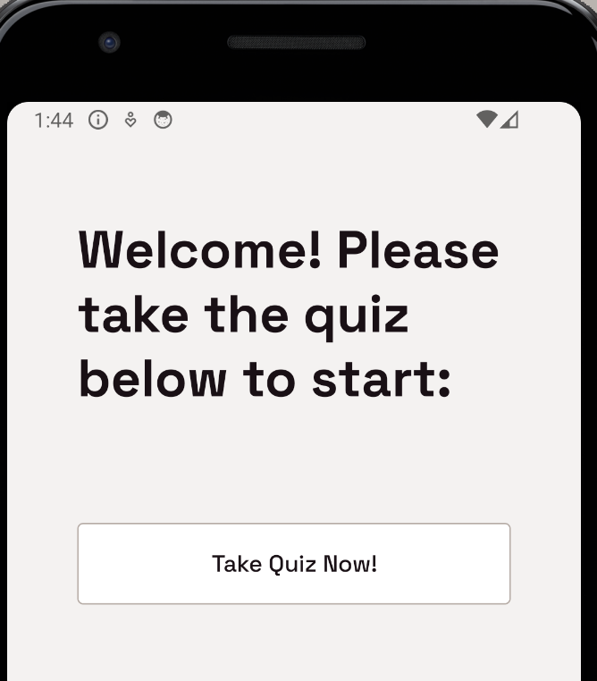

# HealthAI

## Purpose

This project was made using Infinite Red's Ignite boilerplate as the final project for my Prompt Engineering class. We were tasked with implementing an AI model's API into either a web app or mobile app. I decided to choose a mobile app since I have never made one before this class and wanted to gain some experience making one. I chose the Ignite boilerplate as I felt it was a good base layout to help me understand the structure and flow of a mobile application. The usage of expo was something I was drawn to as well since it would allow me to develop for both android and iOS. The app is entirely based in the frontend.

## What This App Does

This app starts on a simple home screen that has a button the user taps to take a quick quiz. A modal appears and the user inputs their responses. After they tap submit, ChatGPT is called through their API and the engineered prompt pattern outputs an exercise and diet plan based on the users responses to the 'Diet' and 'Exercise' screen in a container (I didn't refactor the name of the screens from the boilerplate, so they are titled DemoCommunityScreen and DemoPodcastListScreen respectively). When the container is tapped, a modal opens with ChatGPT's response in an editable text box that the user can change and save to their liking. Only one plan exists at a time.

## What I Changed/Added from Ignite

**Files Edited:**
- package.json (added neccesary packages for modals)
- package-lock.json (added neccesary packages for modals)
- app.tsx (added provider for AI response and the plan modal)
- DemoPodcastListScreen.tsx (Exercise Screen, layout of code is similar to boilerplate, but all code inside this file is from me)
- DemoCommunityScreen.tsx (Diet Screen, layout of code is similar to boilerplate, but all code inside this file is from me)
- DemoShowroomScreen.tsx (Home Screen, still has all its original components and code. Only thing changed is title of screen)
- DemoIcon.tsx (This is where the "Take Quiz Now!" button is rendered, as DemoIcon.tsx is the top item on the DemoShowroomScreen.tsx)
- DemoNavigator.tsx (Where code was changed for the icon and names of tabs)
- Icon.tsx (added food, home, and exercise icons to iconRegistry)

**Files Added:**
- home.png (Home tab icon)
- food.png (Diet tab icon)
- exercise.png (Exercise tab icon)
- Quiz.tsx (Where most of the logic is housed for this project. Contains the logic for the quiz input form, what happens when the user taps submit, and the parsing of AI response to be passed to Diet and Exercise screens)
- PlansContext.tsx (Creates the provider for the modal that is used between the Diet and Exercise Screens)
- Plan.tsx (Logic for the plan modal and how it appears on the screen when a user taps the plan)
- openAiService.tsx (Logic for calling ChatGPT API)
- AIResponseContext.tsx (Creates the provider and logic for rendering the AI response thru app.tsx)

## What I Would Change

I implemented a button to delete a plan if a user chooses, as well as update it in the console log that the plan has been deleted, but it doesn't actually delete the plan at all. When a user taps the save button on the modal, it is the same as if they tap the 'cancel' button, it still saves their edits regardless. I would fix these things, add a backend so that multiple plans can be added, add persistence, as well as clean up the user experience and home screen from boilerplate clutter.

## Screenshots

